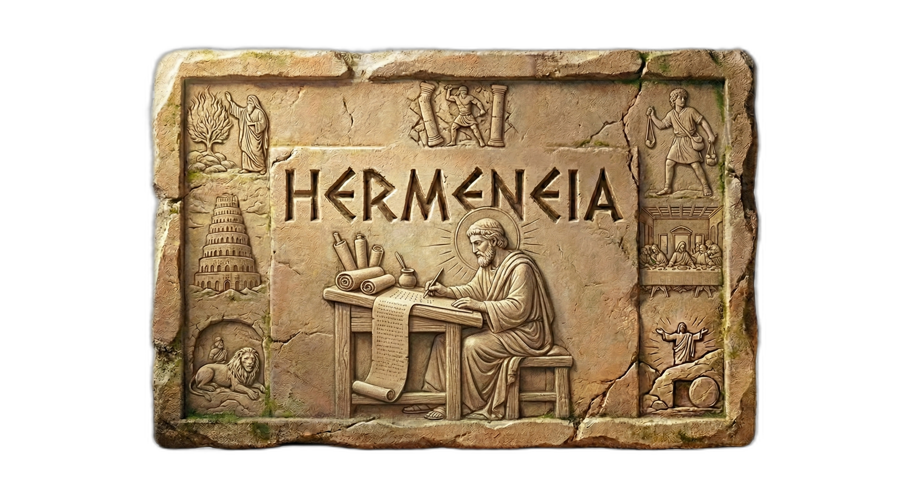

<p align="center">
  
</p>

<p align="center">
  
  
  
</p>

# Hermeneia

**Private, Offline Audio Transcription & Translation**

Transcribe and translate sermons, teachings, and documents entirely on your computer. No cloud services, no proprietary APIs, no large corporation scraping your data, you own your data.

---

## 📁 Project Structure

```
Hermeneia/
├── LICENSE              # GNU Affero General Public License v3.0
├── hermeneia/           # Main application folder
│   ├── src/             # Frontend (SolidJS + TypeScript)
│   ├── src-tauri/       # Backend (Rust + Tauri 2)
│   ├── scripts/         # Build & packaging scripts
│   ├── package.json     # Node dependencies & scripts
│   └── README.md        # Installation & usage guide
└── ml-research/         # Python workspace for model evaluation
    └── src/             # Safetensors conversion & model scripts
```

### What is the `hermeneia/` folder?

The `hermeneia/` directory contains the complete application:
- **Frontend**: SolidJS-based UI for audio editing, transcription, and translation
- **Backend**: Rust-powered audio and AI processing with GPU acceleration
- **Privacy-first**: All processing happens locally — Windows, Linux and macOS builds available

### What is the `ml-research/` folder?

Python workspace for evaluating and converting ML models (e.g. safetensors conversion for MarianMT). Not required to run the app.

See `hermeneia/README.md` for installation and usage instructions.

---

## 🗺️ Development Roadmap (MVP)

### ✅ Phase 1: Audio Processing (Complete)
High-performance audio processing engine with streaming playback
- Multi-format audio support (MP3, FLAC, WAV, OGG, AAC)
- Real-time waveform visualization
- Audio playback with full controls (play, pause, seek)
- Fast audio trimming
- GPU optimization for Linux NVIDIA
- Audio editor UI with dark mode

### ✅ Phase 2: Transcription (Complete)
Convert sermon audio to text using local AI models
- Local speech-to-text engine with GPU acceleration
- Word-level timestamps for precise editing
- Export to multiple formats (TXT, SRT)
- Cancellable inference with real-time progress

### ✅ Phase 3: Translation (Complete)
Translate transcriptions to multiple languages offline
- Local translation engine using MarianMT models via candle-transformers
- 50+ language pairs supported via curated model catalog
- Translation UI with language selection, progress display, and cancellation
- Subtitle/segment-aware translation preserving timestamps
- CLI binary for standalone translation testing
- CUDA and Metal feature flags for GPU acceleration

### ☐ Phase 4: Deployment & Distribution
Package and distribute application for Windows and Linux
- Windows installer (.exe)
- MacOS (ARM, Intel)
- Linux packages (.deb, .AppImage, .rpm)
- CI/CD pipeline for releases
- Complete user documentation   

---


## 🚀 Getting Started

See `hermeneia/README.md` for:
- Installation instructions
- Development setup
- Building for production
- GPU configuration
- Troubleshooting

Quick start:
```bash
cd hermeneia
npm install
npm run dev:tauri
```

---

## 📄 License

GNU Affero General Public License v3.0
